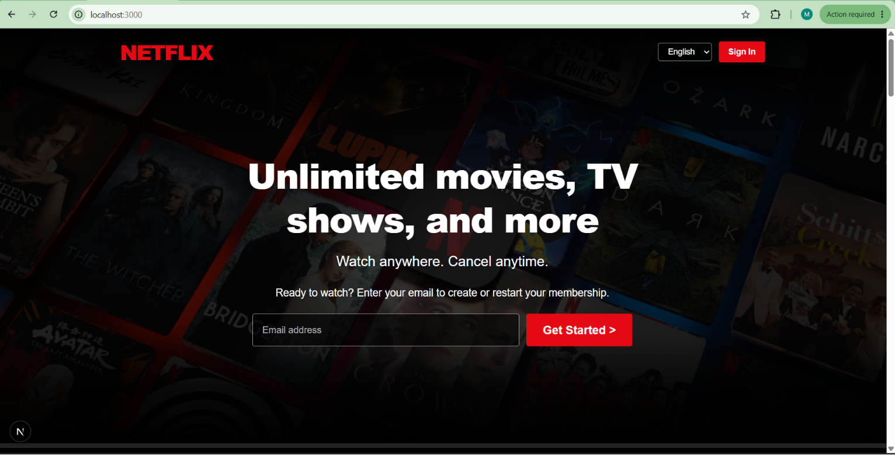
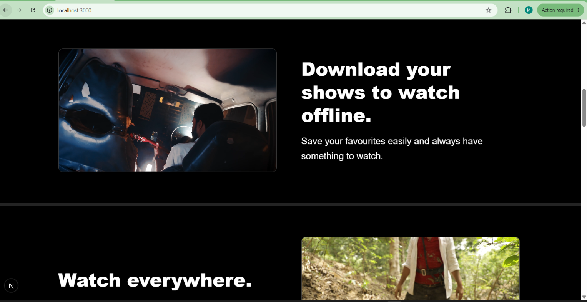
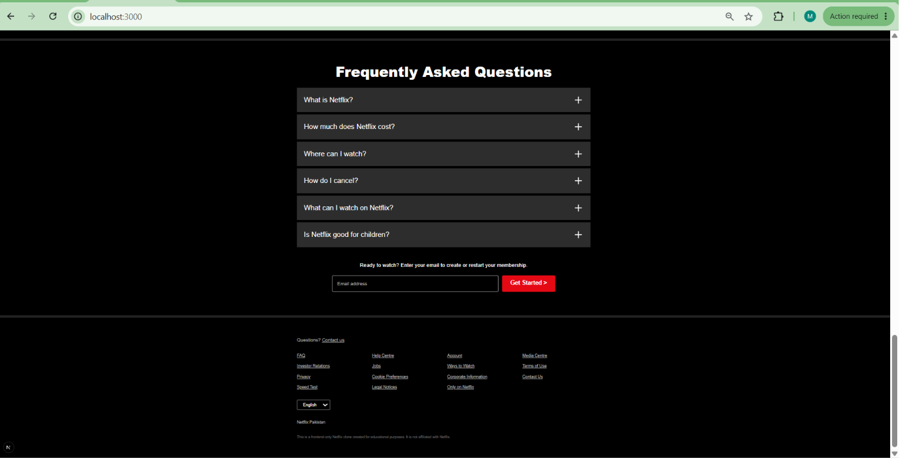
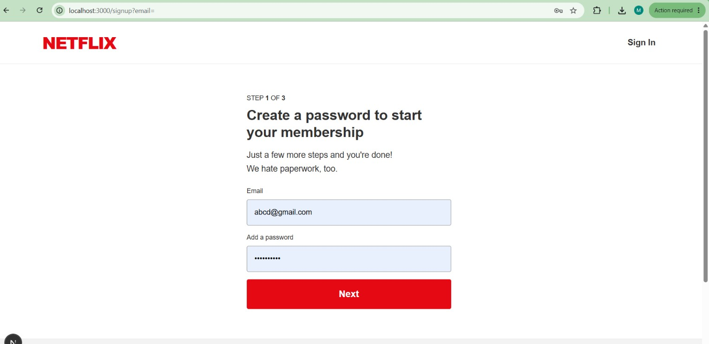
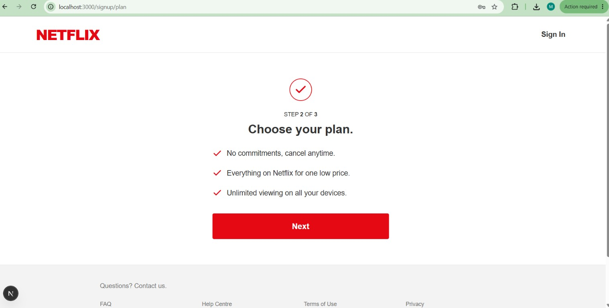
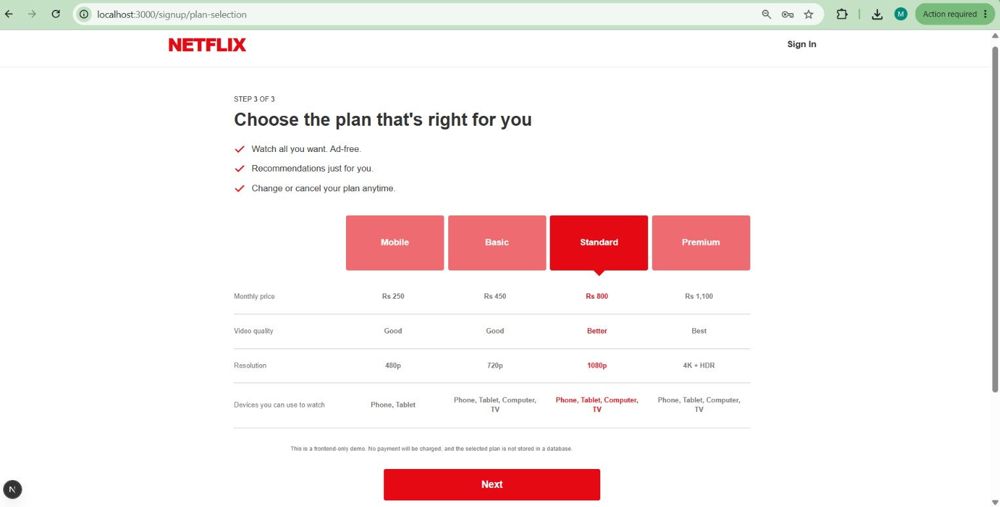
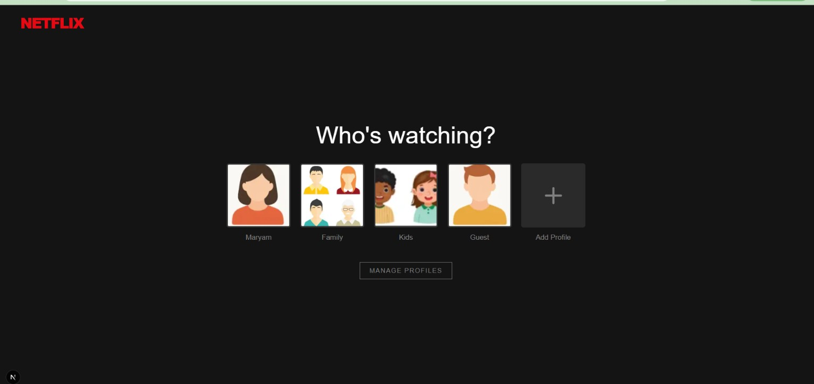
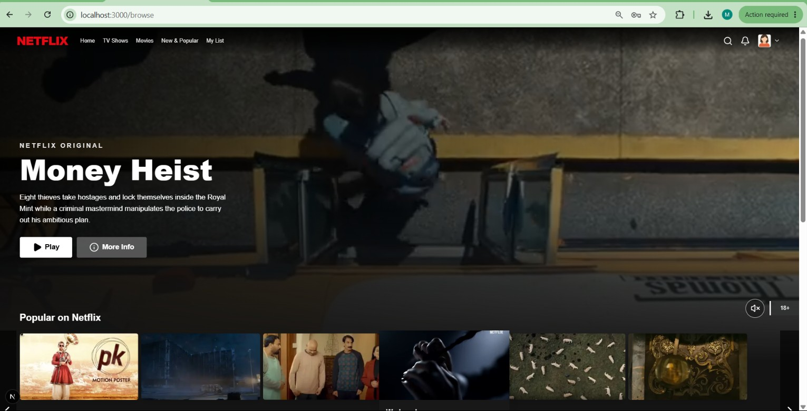

# 🎬 Netflix Clone Frontend

A responsive Netflix-inspired frontend built with **Next.js App Router**, **React**, **TypeScript**, and **Tailwind CSS**.

This project is a frontend-only implementation based on the provided Netflix Figma design. It recreates the user experience of Netflix using reusable components, responsive layouts, local assets, and client-side navigation.

---
# 🚀 Live Demo

**GitHub Repository**

https://github.com/maryam-zahid/netflix-clone
**Vercel Deployment**

https://netflix-clone-8obv7apu1-maryam-zahids-projects.vercel.app
---
# 📸 Project Screenshots

## Landing Page



---

## Hero Section

.png)

---

## Feature Sections



---

## Kids Profile Section

.png)

---

## FAQ Section



---

## Signup Step 1



---

## Signup Step 2



---

## Plan Selection



---

## Profile Selection



---

## Browse Page



---

# ✨ Implemented Pages

- Netflix Landing Page
- Signup (Step 1)
- Choose Plan
- Plan Selection
- Profile Selection
- Browse (Home)

---

# 🔄 User Flow

```text
Landing Page
      │
      ▼
Signup
      │
      ▼
Choose Plan
      │
      ▼
Plan Selection
      │
      ▼
Who's Watching?
      │
      ▼
Browse Page
```

---

# 🧩 Reusable Components

### Landing

- LandingNavbar
- LandingHero
- FeatureSection
- FAQSection
- LandingFooter

### Signup

- SignupForm

### Profiles

- ProfileCard

### Browse

- BrowseNavbar
- BrowseHero

---

# 📁 Project Structure

```text
src
│
├── app
│   ├── browse
│   ├── profiles
│   ├── signup
│   ├── globals.css
│   ├── layout.tsx
│   └── page.tsx
│
├── components
│   ├── browse
│   ├── landing
│   ├── profiles
│   └── signup
│
├── data
│
└── public
    ├── images
    ├── videos
    └── screenshots
```

---

# 💻 Technologies Used

- Next.js 16 (App Router)
- React
- TypeScript
- Tailwind CSS
- Lucide React
- next/image
- next/link

---

# 📱 Responsive Design

The application is responsive across:

- Desktop
- Laptop
- Tablet
- Mobile

Responsive features include:

- Flexible layouts using Flexbox and Grid
- Responsive typography
- Responsive spacing
- Mobile navigation
- Responsive hero section
- Responsive feature sections
- Responsive signup flow
- Responsive profile cards

---

# 🎨 UI Features

- Netflix-inspired Landing Page
- Hero Banner
- Background Videos
- Gradient Overlays
- FAQ Accordion
- Smooth Hover Effects
- Responsive Navigation
- Responsive Signup Flow
- Profile Selection Screen
- Browse Hero Banner
- Scroll-aware Navbar
- Local Video Playback
- Tailwind Animations

---

# 📚 Next.js Concepts Learned

- App Router
- File-based Routing
- Server Components
- Client Components
- useRouter()
- useSearchParams()
- Suspense
- next/image
- next/link
- Static Assets
- Production Build
- TypeScript Integration

---

# 🎨 Tailwind CSS Concepts Learned

- Utility-first CSS
- Responsive Breakpoints
- Flexbox
- CSS Grid
- Positioning
- Gradients
- Hover Effects
- Focus States
- Transition Utilities
- Custom Colors
- Responsive Typography

---

# ⚙️ Installation

Clone the repository

```bash
git clone YOUR_GITHUB_REPOSITORY_URL
```

Move into the project

```bash
cd netflix-clone
```

Install dependencies

```bash
npm install
```

Run the development server

```bash
npm run dev
```

Open

```text
http://localhost:3000
```

---

# 🧪 Project Validation

Run ESLint

```bash
npm run lint
```

Create a Production Build

```bash
npm run build
```

Run Production Server

```bash
npm run start
```

---

# 📌 Current Status

✅ Landing Page

✅ Signup Flow

✅ Plan Selection

✅ Profile Selection

✅ Browse Page

✅ Responsive Design

✅ Reusable Components

✅ Next.js App Router

✅ Tailwind CSS

---

# 📈 Future Improvements

- Movie Rows
- Movie Modal
- TV Shows Page
- Movies Page
- Search Page
- My List
- Video Preview on Hover
- TMDB API Integration
- Authentication
- Backend Integration

---

# 📄 License

This project was created for educational and learning purposes only.

Netflix is a registered trademark of Netflix Inc.

This project is not affiliated with or endorsed by Netflix.